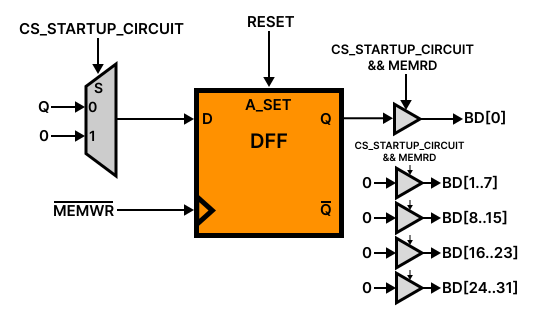

# I/O in tinyDLX
Input and output are managed as memory mapped devices. For now the interaction with the user can be made only from stdin and stdout.

## I/O Devices
For now there are only 5 fixed devices:
 - **Startup Circuit**: 1 bit register which is set to 1 on the startup of the system and can be turned to 0 with a dummy write. It is very useful, since it is the only way to distinct an interrupt from the system startup. No interrupt is asserted.
 - **Input Port**: 8 bits input port. Interrupt is asserted when the port buffer is full.
 - **Output Port**: 8 bits output port. Interrupt is asserted when the port is ready to output.
 - **Interrupt Controller**: it is the controller for the hardware interrupts. When a interrupt from a device is received, its interrupt line is asserted. A read to its specific memory address will return the interrupt code.
 - **Power Manager**: a dummy read/write to this device makes the emulator exit. No interrupt is asserted.
To know the memory mappings and the interrupt codes see [Mapping.md](./Mappings.md).

## Startup Circuit
The startup circuit consists of 1 FFD which is asserted on the emulator startup. A read operation will return the value of the FFD. The FFD value can be set to 0 by a dummy write.
The circuit scheme is as follows.

*RESET is asynchronous and it is asserted on the system startup. CS_STARTUP_CIRCUIT is from the first level decoder*

## Interrupt Controller
All devices interrupt lines are wired into the **Interrupt Controller** (a memory mapped device). When an interrupt is received, the **IC** asserts the DLX interrupt line. Then, the CPU can read the interrupt code from the IC with an opportune read operation. For now there can be 16 device interrupts wired to it.
Once the interrupt code is read by a read operation the interrupt output is turned off.

