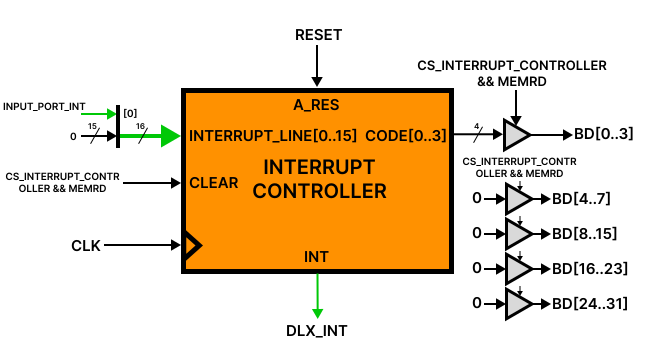

# I/O devices in tinyDLX

Input and output devices are managed as memory-mapped devices (MMIO). This means that the emulated program can interact with a device using store and load instructions at the addresses where it is mapped. The effect of read and write operations differs from device to device. The address of every device is listed in [Memory.md](./Memory.md), and the way devices signal the CPU is described in [Interrupts.md](./Interrupts.md).

## Interrupt Controller

The Interrupt Controller is the only device wired to the DLX interrupt line. In fact, it serves as a buffer for devices' interrupt lines: each device that can assert an interrupt is wired to an interrupt line of the IC. When at least one of its interrupt lines is asserted (by a device) it propagates the interrupt into the DLX's interrupt line. The IC's interrupt output is level-triggered.

Interrupt lines are numbered from 0 to DLX_MAX_DEVICES-1 (0 to 14 currently, since DLX_MAX_DEVICES is 15 and index 15 is reserved). If more than one interrupt line is asserted, the lowest interrupt line index has the highest priority. If no interrupt is asserted, a read operation returns the reserved code `0xF` and so it is never a valid interrupt code.

When the DLX interrupt line is asserted, the handler identifies the source by reading the IC, which returns the index of the highest-priority asserted line. Since the mapping between devices and line indices is fixed, the handler can determine which device generated the interrupt. Reading the IC asserts its CLEAR port, which deasserts that line (see figure below). The IC keeps its output asserted until all pending interrupts have been read.

Note that the deassertion works only inside the IC: the IC does not communicate to the devices that their interrupt has been read. This means that the software must service the device, otherwise it could continue to assert the interrupt if it is level-triggered.

For now only the Input Port can assert an interrupt, so it is the only device wired to the Interrupt Controller (as in figure).

The circuit scheme is as follows.

*RESET is asynchronous and is asserted on system startup. CS_INTERRUPT_CONTROLLER is from the first-level decoder*

## Startup Circuit

The startup circuit consists of a single DFF which is asserted on emulator startup. A read operation will return the value of the DFF. The DFF value can be set to 0 by a dummy write. On startup the handler at address 0 reads the Startup Circuit, finds it asserted, clears it with a dummy write, and proceeds with initialization. Every later entry at address 0 reads 0 and is therefore an interrupt.

The circuit scheme is as follows.

*RESET is asynchronous and is asserted on system startup. CS_STARTUP_CIRCUIT is from the first-level decoder*

## Input Port

The Input Port is the device used to standardize external input units. It exposes one byte of input at a time and is wired to interrupt line 0 of the IC.

The port holds a single byte latch. When the external unit presents a byte and the latch is free, the byte is latched and the port asserts its interrupt line. The port does not buffer more than one byte: while the latch is full no further byte is accepted, and the external unit has to hold the next one until the port is free again.

The port's interrupt output is level-triggered and stays asserted for as long as the latch holds an unread byte. Reading the IC clears the line inside the IC, but the Input Port keeps reasserting it until the port itself is read, so the handler must always service the port and not just acknowledge the IC.

A read returns the latched byte, empties the latch and deasserts the interrupt line, which frees the port to latch the next byte. A read performed when no byte is pending returns the last byte that was latched, so software must not use the data value alone to decide whether input has arrived. The port has no write port.

## Output Port

The Output Port is the device used to standardize external output units. It accepts one byte at a time and exposes a status flag; it has no interrupt line, so it is driven by polling only.

A read returns the port status: `1` when the port is ready to accept a byte, `0` while it is busy transferring the previous one.

A write sends the least significant byte of the written value to the external unit; the remaining bits are ignored. The port then goes busy for a fixed number of clock cycles, during which the status reads `0`. A write performed while the port is busy is discarded: the byte is lost and no error is signalled. Software must therefore read the status and wait for it to be `1` before every write, and must not rely on a fixed number of cycles between two writes.

## Power Manager

The Power Manager is the device used to turn off the system. It has neither an interrupt line nor a read port: the only supported operation is a write.

A write turns the system off, regardless of the value written. The shutdown is a normal one: the system stops after the instruction that performed the write, and no further instruction is executed.
